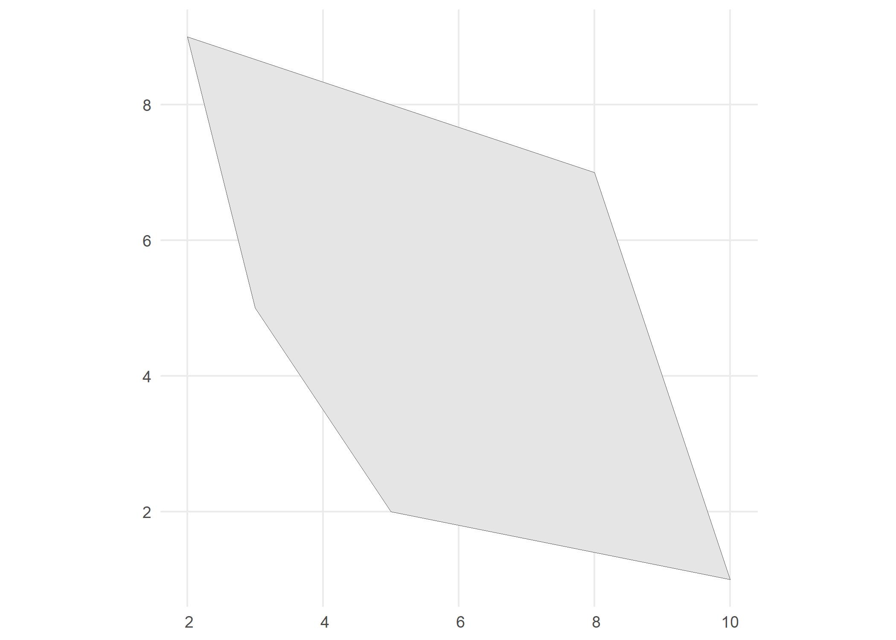
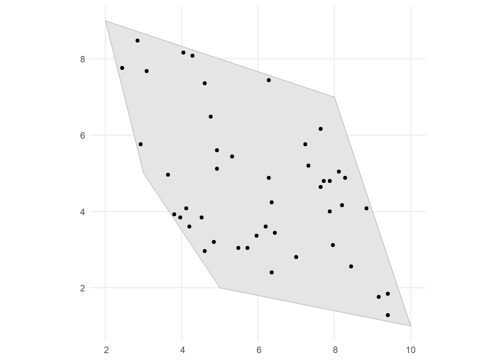
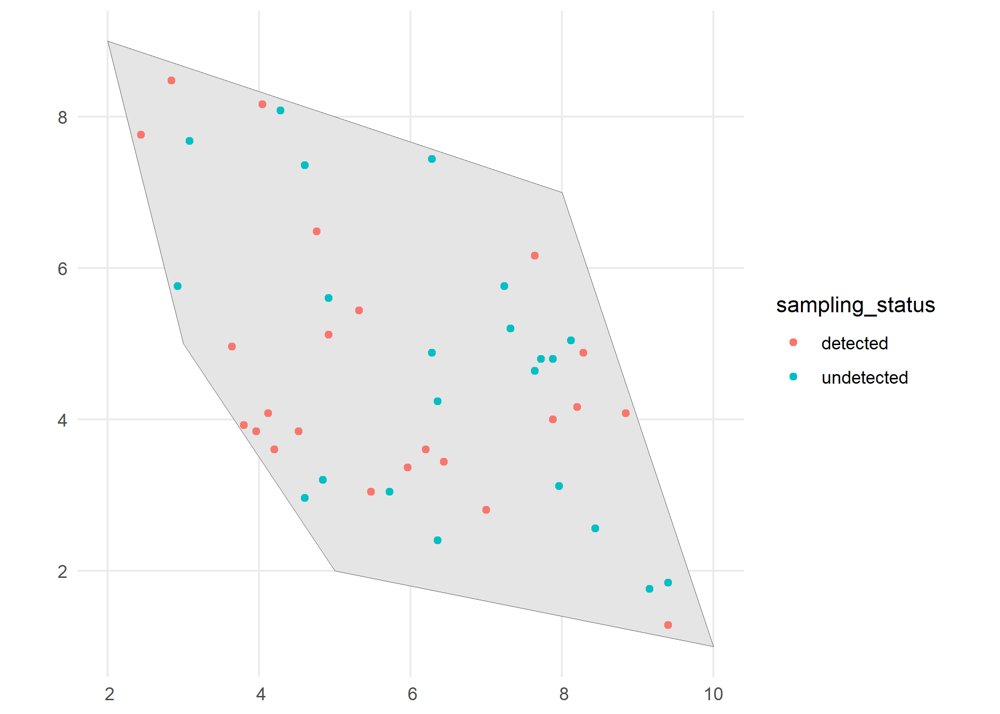
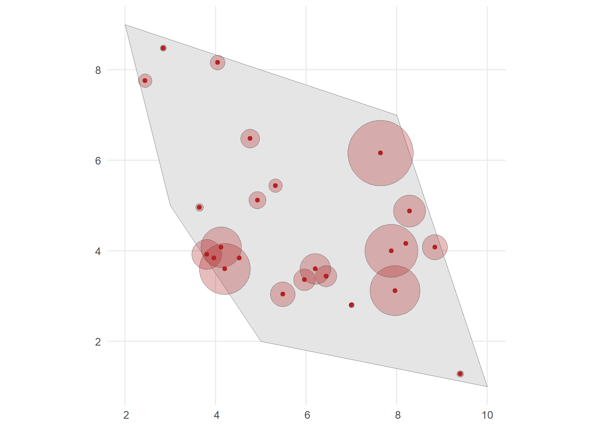

------------------------------------------------------------------------

\* Corresponding author:
[ward.langeraert\@inbo.be](mailto:ward.langeraert@inbo.be){.email}

#### Keywords:

Simulation, Data cubes, Biodiversity, B-Cubed, Monte-Carlo, R package

------------------------------------------------------------------------

## Abstract


## Introduction
Simulation studies offer numerous benefits due to their ability to mimic real-world scenarios in controlled and customizable environments. Ecosystems and biodiversity data are very complex and involve a multitude of interacting factors. Simulations allow researchers to model and understand the complexity of ecological systems by varying parameters such as spatial and/or temporal clustering, species prevalence, etc.

During the B-Cubed Hackathon (Hacking Biodiversity Data Cubes for Policy), we aimed to create a practical simulation framework for biodiversity data cubes based on Monte Carlo methods (= based on repeated random sampling). This framework is composed of three steps ([Fig. 1](#Figure_1)):

1. The occurrence process: Simulating occurrences of multiple species distributed in a landscape over a temporal scope. This will depend on the **rarity**, which can differ between species and over time, and their **spatial clustering**, which can differ between species. A challenge for this part is to implement a consistent **spatial and temporal autocorrelation** for simulated species trends.
2. The detection process: Simulation of a variety of observation processes can generate actual occurrence datasets. Each species has a different **detection probability**. The detection process will also depend on the **sampling effort** which can be different among spatial and temporal dimensions. We can also assign a spatial uncertainty to each observation.
3. The grid designation process: Based on their spatial uncertainty, occurrences can be designated to grid cells of a larger grid to form a data cube.

The simulation framework can be used to assess multiple research questions under different parameter settings, such as the effect of clustering on occurrence-to-grid designation and the effect of different patterns of missingness on data quality and indicator robustness. Simulation studies can incorporate scenarios with missing data, enabling researchers to assess the impact of data gaps on analyses. Understanding how missing data influences results is crucial for improving data collection strategies and addressing potential biases. With this, the secondary objective of the simulation study is to develop a visualisation tool for the simulated cubes. This tool aims to enhance the understanding of data clustering and missingness within the simulated environment. By creating a visual representation, researchers can effectively analyse and interpret patterns of clustered data as well as identify areas where data is missing. This visualization capability contributes to a more comprehensive exploration of the simulated scenarios, allowing for deeper insights into the behaviour of data within the context of the study.

The B-Cubed Hackathon took place from 2-5 April 2024. This paper describes the methods and results of projects 2+8 during this hackathon unless mentioned otherwise.

{#Figure_1
.Figure}

## Materials and Methods
### Technical setup
It was *a priori* decided by the first author to build the simulation framework using the R programming language as an R package [@R2024lang], where participants could collaborate efficiently with each other via GitHub (https://github.com/).
A repository for this package was prepared under the name 'simcuber' and a code structure was proposed for the framework (see next section).

Common guidelines for software development (e.g. related to coding style, function naming and unit testing) were mentioned to ensure efficient collaboration as well as future maintenance and development [@huybrechts2024guidelines].

### Code architecture
General code architecture of the package was proposed following preparation of the hackathon by the first author.
As indicated in the introduction, the simulation framework and thus the R package can be divided into three different processes related to different variables that depend on *species*, *observation*, *space* and *time*.

1. occurrence process
2. detection process
3. grid designation process

For grid designation, R code was already available as the function `grid_designation()`. The focus of the hackathon was thus on the occurrence and detection processes.

|   Process  |        Variable        |   Dependency  |
|------------|------------------------|---------------|
| occurrence | rarity                 | species, time |
| occurrence | spatial clustering     | species       |
| detection  | detection probability  | species       |
| detection  | sampling effort        | space, time   |
| detection  | spatial uncertainty    | observation   |

The three processes can be described in three main functions respectively `simulate_occurrences()`, `sample_observations()` and `grid_designation()`. These can depend on multiple supporting functions for example per variable mentioned above or for specific subprocesses (e.g. temporal autocorrelation).

Some (pseudo)code and ideas for implementation were provided by the first author for `simulate_occurrences()` and `sample_observations()`:

``` {#Code_1 .r .Code}
simulate_occurrences(
  polygon,
  initial_average_abundance = 50,
  spatial_autocorr = c("random", "clustered", "regular"),
  n_time_points = 10,
  temporal_autocorr = ifelse(time_points ==  1, NA, "random_walk"),
  spatiotemporal_autocorr = NA,
  seed = NA
)
```

- **polygon**:

An sf object with POLYGON geometry indicating the spatial extend to simulate occurrences.

- **initial_average_abundance**:

A positive integer value indicating the average number of occurrences to be simulated within the extend of `polygon` at time point 1. This value will be used as mean of a Poisson distribution ($\lambda$ parameter).

- **spatial_autocorr**:

`"random"`, `"clustered"`, `"regular"` or a numeric value between -1 and 1 representing Moran's I. `"random"` corresponds to 0, `"clustered"` to 0.9 and `"regular"` to -0.9.

- **n_time_points**:

A positive integer value indicating the number of time points to simulate.

- **temporal_autocorr**:

`NA`, `"random_walk"` or a function which generates a trend in abundance over time. Only used if `time_points > 1`. When there are multiple time points and `"random_walk"` is selected, an internal function can be used to create a random walk over time. The user is also free to specify its own function that depends on `initial_average_abundance` and `n_time_points`, e.g. a linearly decreasing trend over time.

- **spatiotemporal_autocorr**:

A numeric value between indicating the strength of spatiotemporal autocorrelation.

- **seed**:

A positive numeric value. The seed for random number generation to make results reproducible. If `NA` (the default), no seed is used.

``` {#Code_2 .r .Code}
sample_observations(
  occurrences,
  detection_probability = 1,
  sampling_bias = c("no_bias", "polygon", "manual"),
  bias_area = NA,
  bias_strength = NA,
  bias_weights = NA,
  coordinate_uncertainty_meters = 25,
  seed = NA
)
```

- **occurrences**:

An sf object with POINT geometry.

- **detection_probability**:

A numeric value between 0 and 1, corresponding to the probability of detection of the species.

- **sampling_bias**:

`"no_bias"`, `"polygon"` or `"manual"`. The method used to generate a sampling bias (cf. the **virtualspecies** package @leroy2016virtualspecies). `"polygon"`: bias the sampling in a polygon. Provide your polygon to `bias_area`. Provide bias strength to `bias_strength`. `"manual"`: bias the sampling manually via a raster. Provide your raster layer in which each cell contains the probability to be sampled to `bias_weights`.

- **bias_area**:

`NA` or an sf object with POLYGON geometry. Only used if `sampling_bias = "polygon"`. The area in which the sampling will be biased.

- **bias_strength**:

`NA` or a positive numeric value. Only used if `sampling_bias = "polygon"`. The strength of the bias to be applied in the biased area (as a multiplier). Above 1, area will be oversampled. Below 1, area will be undersampled. For example, a value of 50 will result in 50 times more samples within the `bias_area` than outside. Conversely, a value of 0.5 will result in half less samples within the `bias_area` than outside.

- **bias_weights**:

`NA` or a raster layer (sf object with POLYGON geometry, or SpatRaster object). Only used if `sampling_bias = "manual"`. The raster of bias weights to be applied to the sampling of occurrences. Higher weights mean a higher probability of sampling. Weights can be numeric values between 0 and 1 or positive integers that will be rescaled to values between 0 and 1.

- **coordinate_uncertainty_meters**:

A positive numeric value or vector with length `nrow(occurrences)` describing the uncertainty in meters around each observation.

- **seed**:

A positive numeric value. The seed for random number generation to make results reproducible. If `NA` (the default), no seed is used.

Finally, we also have the function `add_coordinate_uncertainty()`.

``` {#Code_3 .r .Code}   
add_coordinate_uncertainty(
  occurrences,
  coordinate_uncertainty_meters = 25
)
```

This function is a supporting function for `sample_observations()` to add a `coordinateUncertaintyInMeters` column that should also be openly available in case users simulate observations based on virtual species distributions. This can for example be accomplished using the **virtualspecies** package [@leroy2016virtualspecies]:

1.  Species-environment relationship
    -   `generateSpFromFun()`
    -   `generateSpFromPCA()`
2.  Conversion to presence-absence
    -   `convertToPA()`
    -   introduce distribution bias: `limitDispersal()`
3.  Sample occurrences
    -   `sampleOccurrences()`
4.  Convert to sf object with POINT geometry
    -   `sf::st_as_sf()`
    -   create helper function `virtualspecies_to_sf()`?

### Collaboration and division of tasks
Following the information provided in the previous subsections, four types of tasks were distinguished ([Fig. 2](#Figure_2)).

1. **Low level tasks**: Tasks related to supporting and helper functions of the high level functions `simulate_occurrences()` and `sample_observations()`. They were the first priority of the development process during the hackathon.

|             Task         |                    Description               |      High level relation    |
|--------------------------|----------------------------------------------|-----------------------------|
| spatial autocorrelation  | add spatial autocorrelation helper function  | occurrence process function |
| temporal autocorrelation | add temporal autocorrelation helper function | occurrence process function |
| detection probability    | implement detection probability              | detection process function  |
| sampling bias            | add sampling bias helper function            | detection process function  |
| coordinate uncertainty   | add coordinate uncertainty helper function   | detection process function  |

2. **High level tasks**: These tasks combine the low level functions into the main, high level functions `simulate_occurrences()` and `sample_observations()`. They were the final priority of the development process during the hackathon.

|         Task         |                                 Description                                  |
|----------------------|------------------------------------------------------------------------------|
| simulate occurrences | combine supporting and helper functions in `simulate_occurrences()` function |
| sample observations  | combine supporting and helper functions in `sample_observations()` function  |

3. **Technical tasks**: These tasks encompass general code development and testing. They were required throughout the development process of the hackathon.

|        Task       |                 Description                    |
|-------------------|------------------------------------------------|
| unit tests        | create unit tests and calculate code coverage  |
| documentation     | maintain function and package documentation    |
| pkgdown website   | maintain pkgdown website [@pkgdown2024wickham] |
| GitHub repository | maintain GitHub repository                     |

4. **Creative tasks**: Random tasks that require out of the box or creative thinking and which are (mainly) independent from other tasks. Participants were encouraged to come up with interesting applications and links to other frameworks/concepts/software/... These tasks could be done throughout the development process of the hackathon.

|              Task              |                               Description                                 |
|--------------------------------|---------------------------------------------------------------------------|
| spatiotemporal autocorrelation | add spatiotemporal autocorrelation helper function                        |
| virtualspecies                 | create functions to link to **virtualspecies** [@leroy2016virtualspecies] |
| vignettes                      | create vignettes                                                          |
| ...                            | ...                                                                       |

{#Figure_2 .Figure width=500px}

Using a Google Form we got an overview of participants' interest in the different tasks, and an idea where a potential lack of coverage might arise. Tasks were divided and followed up via a simple scrum methodology by using sticky notes (coloured by task type) on a board. The board was divided in four parts (from left to right): 'Ice Box', 'In Progress', 'Review', and 'Complete'. The 'Ice Box' is where all the potential tasks and ideas were stored before they were prioritized and selected for development. The 'In Progress' category contains tasks that the team was actively working on during development. The 'Review' category is for tasks that have been completed but are awaiting review, testing, or approval. The 'Complete' category includes tasks that have been reviewed, approved, and finalized. Participants were free to choose and add tasks to the scrum board, indicating the task and their name on the sticky note.

## Results
### Collaboration
Taks were efficiently distributed along the participants ([Fig. 3](#Figure_3)). In total, we collaborated with fourteen people pushing 209 commits to the main branch and 300 commits to all branches. On main, 56 files were changed and there have been 2,856 additions and 373 deletions. By the end of the hackathon, we had a functional pkgdown website ([Fig. 4](#Figure_4)), all CMD checks passed and we had a code coverage of 67%.

{#Figure_3 .Figure}

{#Figure_4 .Figure}

### Package development
The package was renamed to **gcube** which stands for ‘generate cube’ since it can be used to generate biodiversity data cubes from minimal input. 

``` {#Code_4 .r .Code}
simulate_occurrences(
  plgn,
  initial_average_abundance = 50,
  spatial_autocorr = c("random", "clustered"),
  n_time_points = 1,
  temporal_function = NA,
  ...,
  seed = NA
)
```

``` {#Code_5 .r .Code}
sample_observations(
  occurrences,
  detection_probability = 1,
  sampling_bias = c("no_bias", "polygon", "manual"),
  bias_area = NA,
  bias_strength = 1,
  bias_weights = NA,
  seed = NA
)
```

### Incorporation of virtual species to the simulation workflow
Project 8 originally aimed to address the challenges of incomplete and unreliable biodiversity data which hinder accurate species distribution models (SDMs). By creating virtual species with known ecological characteristics, researchers can simulate and analyse the effects of spatial, temporal, and taxonomic uncertainties. This "virtual ecologist" approach helps quantify sources of error and refine modelling techniques. The ultimate goal is to improve conservation planning, especially for rare or endangered species, by providing more reliable predictions of species distributions under various environmental conditions, including climate change.

At an early stage of the hackathon, it was determined that the concepts and ideas developed by this group would be integrated into the cube simulation package of group 2. This decision was influenced by the existing proposal to incorporate a virtual species workflow using the **virtualspecies** package, as mentioned above. The focus was primarily on discussions, conceptualization, and experimentation with the code of both the **virtualspecies** package and the **gcube** package as it was being developed at the time.

The idea of working with a virtual species species approach in **gcube** is that simulations can start from two points.

1. Original **gcube** workflow: Start from empty polygon and mathematical concepts.
2. **virtualspecies** workflow: Start from environmental data layers.

We identified the needs for future development of the virtual species species approach. Link functions are required that accept output from the **virtualspecies** package and provide input for the three main simulation functions of **gcube**.

| Output from **virtualspecies** | Link function **gcube** (to be developed) | Input for **gcube** function |
|--------------------------------|-------------------------------------------|------------------------------|
| create environmental suitability map (from `generateSpFromFun()` or `generateSpFromPCA()`) | `rescale_suitability_raster()`?  | `simulate_occurrences()` |
| presence-absence map (from `convertToPA()`) | `occurrences_from_raster()`? | `sample_observations()` |
| sampled presence points (from `sampleOccurrences()`) | `virtual_occurrences_to_sf()` | `add_coordinate_uncertainty()` and/or `grid_designation()` |

This is currently not implemented in the package.

## gcube workflow example
This is a basic example from the README which shows the workflow for simulating a biodiversity data cube using the **gcube** package. This is not the exact README example from the hackathon, but a cleaned version from the week after. It uses the exact code as developed during the hackathon, but at that time we did not have enough time to create a clean README example.

The workflow is divided in three steps or processes:

1.  Occurrence process
2.  Detection process
3.  Grid designation process

The functions are set up such that a single polygon as input is enough
to go through this workflow using default arguments. The user can change
these arguments to allow for more flexibility.

``` r
# Load packages
library(gcube)

library(sf)      # working with spatial objects
library(dplyr)   # data wrangling
library(ggplot2) # visualisation with ggplot
```

We create a random polygon as input.

``` r
# Create a polygon to simulate occurrences
polygon <- st_polygon(list(cbind(c(5, 10, 8, 2, 3, 5), c(2, 1, 7,9, 5, 2))))

# Visualise
ggplot() + 
  geom_sf(data = polygon) +
  theme_minimal()
```

{width=500px}

**1. Occurrence process**

We generate occurrence points within the polygon using the
`simulate_occurrences()` function. These are the “real” occurrences of
the species, whether we have observed them or not. In the
`simulate_occurrences()` function, the user can specify different levels
of spatial clustering, and can define the trend change of the species
over time.

``` r
# Simulate occurrences within polygon
occurrences_df <- simulate_occurrences(
  plgn = polygon,
  seed = 123)
#> [using unconditional Gaussian simulation]

# Visualise
ggplot() + 
  geom_sf(data = polygon) +
  geom_sf(data = occurrences_df) +
  theme_minimal()
```
{width=500px}

**2. Detection process**

In this step we define the sampling process, based on the detection
probability of the species and the sampling bias. This is done using the
`sample_observations()` function. The default sampling bias is
`"no_bias"`, but bias can also be inserted using a polygon or a grid.

``` r
# Detect occurrences
detections_df_raw <- sample_observations(
  occurrences = occurrences_df,
  detection_probability = 0.5,
  seed = 123)

# Visualise
ggplot() + 
  geom_sf(data = polygon) +
  geom_sf(data = detections_df_raw,
          aes(colour = sampling_status)) +
  theme_minimal()
```

{width=500px}

We select the detected occurrences and add an uncertainty to these
observations. This can be done using the `add_coordinate_uncertainty()`
function.

``` r
# Select detected occurrences only
detections_df <- detections_df_raw %>%
  dplyr::filter(sampling_status == "detected")

# Add coordinate uncertainty
set.seed(123)
coord_uncertainty_vec <- rgamma(nrow(detections_df), shape = 2, rate = 6)
observations_df <- add_coordinate_uncertainty(
  observations = detections_df,
  coords_uncertainty_meters = coord_uncertainty_vec)

# Created and sf object with uncertainty circles to visualise
buffered_observations <- st_buffer(
  observations_df,
  observations_df$coordinateUncertaintyInMeters)

# Visualise
ggplot() + 
  geom_sf(data = polygon) +
  geom_sf(data = buffered_observations,
          fill = alpha("firebrick", 0.3)) +
  geom_sf(data = observations_df, colour = "firebrick") +
  theme_minimal()
```

{width=500px}

**3. Grid designation process**

Finally, observations are designated to a grid to create an occurrence
cube. We create a grid over the spatial extend using
`sf::st_make_grid()`.

``` r
# Define a grid over spatial extend
grid_df <- st_make_grid(
    buffered_observations,
    square = TRUE,
    cellsize = c(1.2, 1.2)
  ) %>%
  st_sf() %>%
  mutate(intersect = as.vector(st_intersects(geometry, polygon,
                                             sparse = FALSE))) %>%
  dplyr::filter(intersect == TRUE) %>%
  dplyr::select(-"intersect")
```

To create an occurrence cube, `grid_designation()` will randomly take a
point within the uncertainty circle around the observations. These
points can be extracted by setting the argument `aggregate = FALSE`.

``` r
# Create occurrence cube
occurrence_cube_df <- grid_designation(
  observations = observations_df,
  grid = grid_df,
  seed = 123)

# Get sampled points within uncertainty circle
sampled_points <- grid_designation(
  observations = observations_df,
  grid = grid_df,
  aggregate = FALSE,
  seed = 123)

# Visualise grid designation
ggplot() +
  geom_sf(data = occurrence_cube_df, linewidth = 1) +
  geom_sf_text(data = occurrence_cube_df, aes(label = n)) +
  geom_sf(data = buffered_observations,
          fill = alpha("firebrick", 0.3)) +
  geom_sf(data = sampled_points, colour = "blue") +
  geom_sf(data = observations_df, colour = "firebrick") +
  labs(x = "", y = "", fill = "n") +
  theme_minimal()
```

{width=500px}

The output gives the number of observations per grid cell and minimal
coordinate uncertainty per grid cell.

``` r
# Visualise minimal coordinate uncertainty
ggplot() +
  geom_sf(data = occurrence_cube_df, aes(fill = min_coord_uncertainty),
          alpha = 0.5, linewidth = 1) +
  geom_sf_text(data = occurrence_cube_df, aes(label = n)) +
  scale_fill_continuous(type = "viridis") +
  labs(x = "", y = "") +
  theme_minimal()
```

{width=500px}

## Discussion


## Conclusions and future work


- multispecies

- implement virtual species

- unit tests for all functions

- documentation complete

- issues: eg bugs: crs, improvements: column names, enhancements: spatial pattern, spatiotemporal connection

## Links to software
-gcube repo

-Commit hash meegeven van einde hackathon: reference point to know what version of the software you reviewed.
https://github.com/b-cubed-eu/gcube/commit/6cceb2b229ac25d1df47a9c3a2e20b464f827e18


## Acknowledgements
We would like to express our gratitude to the Horizon Europe funded B-Cubed (Biodiversity Building Blocks for policy) project for the organisation of this hackathon.
Special thanks go to Laura Abraham of Meise Botanic Garden for her outstanding efforts in coordinating the event.
Additionally, we acknowledge the Research Foundation - Flanders (FWO) and KU Leuven for the support they gave us in making this event possible.

## References